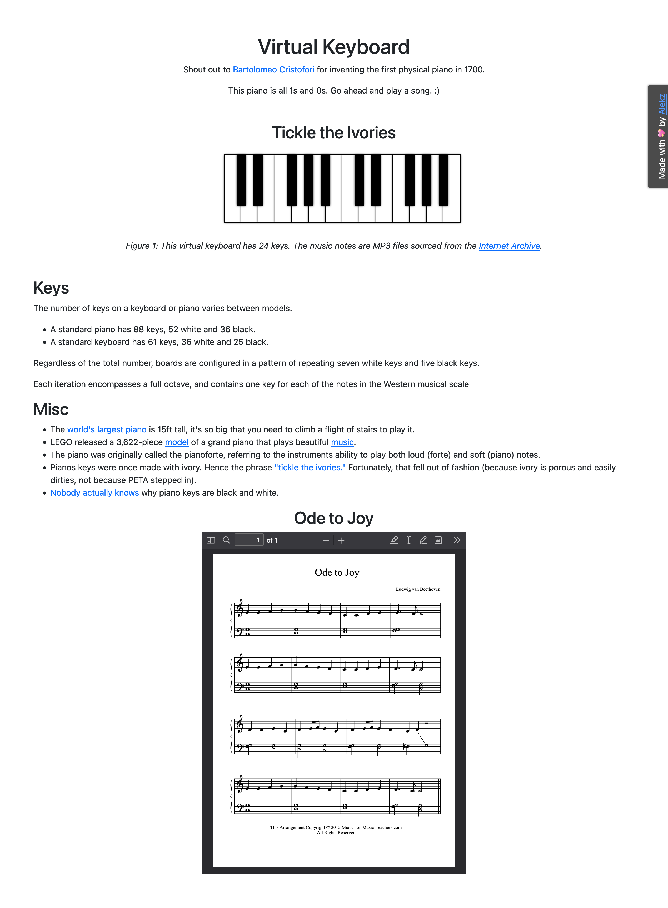

# virtual-piano

🎹 A virtual piano 🎹 This project was a lot of fun to make!

## Here’s how it works:

### HTML

- The keys are made using an unordered list.
- Each list item holds either 1 span element (for a single white key), or 2 span elements (for a pair of white and black keys).
- Each key is numbered from 1-24 and that data is held in a custom data attribute, the title attribute is used to display the musical note of the key.

### CSS

- The list items are laid out horizontally using CSS flexbox and then given colours, borders and shadows to create the visual appearance of a piano key.
- Each key is given the class name “key” which is used to target the elements with JavaScript.

### JS

- By creating an array of all of the key elements, I can loop through them and add a click event to each one.
- The click event is used to access the custom key data attribute on each key, so that clicking each key will play a distinct audio sound from the mp3 files stored in the “audio” directory.
- The audio files are open sourced by the [Internet Archive](https://archive.org/details/24-piano-keys).

## Layout

As I’ve developed my skills and personal style the page layout has developed as well.

The first iteration was just a simple web page with very little styling. The main objective at the time was to create a functional piano, but I decided to add some facts that I learned while researching and embed some sheet music.

The second iteration was a bit more experimental. I was really into the minimal brutalism aesthetic at the time. I created a marquee notification banner at the top of the page. The sheet music was moved to a modal window to make the page look cleaner.

The most recent iteration uses a more modern and simple approach. The piano is the focal point, and the supplementary information was moved to a separate page. The sheet music modal was moved to the navigation menu.

## To-Do

- I’m still not sure the layout is quite right. I have a feeling I’ll be improving on this again sometime in the future.
- The mobile rendering is usable, but not fantastic. I need to spend some time adding media queries that format the text and spacing to make everything look and feel better.
- I also want to spend some time looking into accessibility optimizations (for example, I did blur the background behind the text to accommodate colour contrast for readability, but I think I can do better)
- It would be cool to be able to see the sheet music while still having access to the piano so that people can use it without having to download the file

# Attributions

Dusty Background Texture - [Freepik](https://www.freepik.com/free-vector/detailed-grunge-style-dusty-overlay-texture_16080132.htm#query=texture%20svg&position=2&from_view=keyword&track=ais)

Piano audio (MP3) - [Internet Archive](https://archive.org/details/24-piano-keys).
